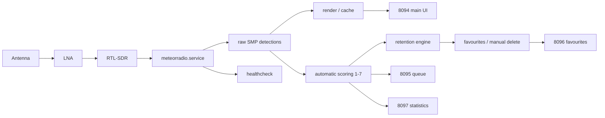
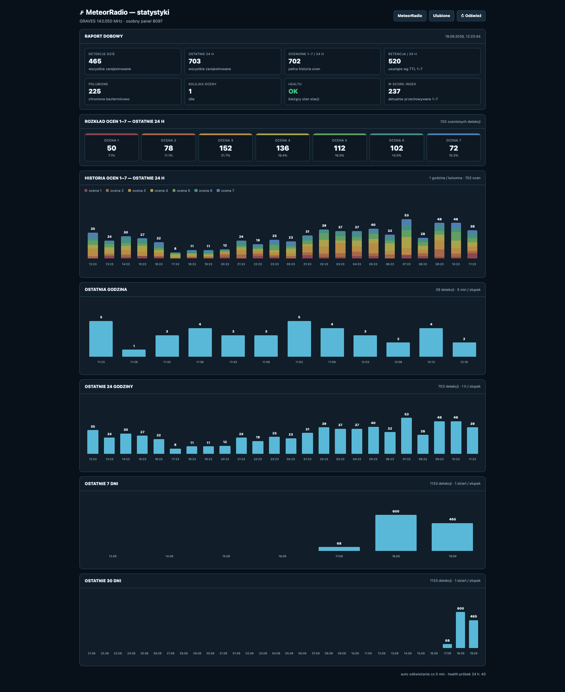
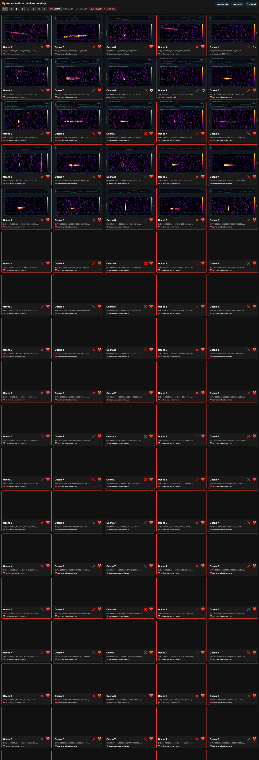

# MeteorRadio V5 — Raspberry Pi + RTL-SDR GRAVES 143.050 MHz Radio Meteor Detector

MeteorRadio V5 is a documented **Raspberry Pi 4 + RTL-SDR radio meteor detector** and **meteor-scatter monitoring station** for the **GRAVES 143.050 MHz** carrier. It extends the upstream **MeteorRadio** acquisition/detection core with adaptive capture, automatic scoring, retention, web dashboards, cached waterfall rendering, health monitoring, and optional shared-RTL-SDR arbitration for citizen-science radio observations.

> **Repository status:** GitHub-ready documentation and station overlay. The upstream MeteorRadio core is intentionally **not** included in the public tree until redistribution/licensing is clarified. See [`UPSTREAM_LICENSE_NOTICE.md`](UPSTREAM_LICENSE_NOTICE.md).

<!-- MR_SHOWCASE_V1 -->
## Project preview


The main dashboard combines Raspberry Pi health, detection browsing, spectrum analysis, a GRAVES meteor-scatter waterfall, event parameters, and the local 1–7 detection score in one interface.


## Reference build

- Reference snapshot: `20260919_023454_V5`
- Golden manifest: 69 files
- Golden size: about 1.2 MB (without raw SMP data and PNG cache)
- Golden `SHA256SUMS.txt` SHA-256: `36dfebd31fec749266fa5f5b902635feef7bd75add4bd57c6205806f22c98b9f`
- Target radio frequency: **143.050 MHz** (GRAVES)
- Platform used for the reference station: Raspberry Pi 4, Debian/Trixie-class aarch64 system, RTL-SDR

## What V5 adds

- `ADAPTIVE_CAPTURE_V2`
  - 1.5 s pre-trigger context
  - 0.8 s minimum post-trigger period
  - 1.0 s quiet/hang time
  - 10 s maximum post-trigger limit
- local automatic detection scoring from **1 to 7**
- score-based retention: **1–7 days** for unliked detections
- liked detections kept indefinitely until manually removed
- manual deletion from the web UI
- background pre-rendering of detection images
- system health monitoring
- four local web panels:
  - `8094` — main MeteorRadio detections UI
  - `8095` — scoring queue/status
  - `8096` — favourites/retention + full-size image modal
  - `8097` — statistics
- optional RTL-SDR ownership arbitration for stations sharing one dongle with another receiver

## Architecture



## Public repo vs local reference

This folder is deliberately split into two layers:

1. **Public GitHub material** — docs, custom web/statistics/services/tools and safe configuration examples.
2. **Local-only reference** — when you run `IMPORT_FROM_INSTALLER.command`, the modified upstream core and machine-specific reference metadata are placed under `private_reference/`, which is ignored by Git.

That design lets you document and publish the station without accidentally uploading station history, exact coordinates, raw detections, cache images, or upstream code whose redistribution status is unclear.

## Populate this repository from the final installer

On the Mac that contains:

```text
~/Desktop/MeteorRadio_V5_ChatGPT_Installer.zip
```

run:

```bash
chmod +x IMPORT_FROM_INSTALLER.command
./IMPORT_FROM_INSTALLER.command
```

The importer verifies the installer manifest, copies the custom station layer into `software/` and `deployment/`, and keeps the modified upstream core only in `private_reference/`.

Then run:

```bash
chmod +x VALIDATE_BEFORE_GITHUB.command
./VALIDATE_BEFORE_GITHUB.command
```

## Screenshots

### Statistics and station history



### Detection gallery



[Open the full detection gallery screenshot](assets/screenshots/detections-gallery-full.png) · [More screenshots and UI notes](docs/SHOWCASE.md)

## Documentation

Start with [`docs/00_START_HERE.md`](docs/00_START_HERE.md).

Key documents:

- [`docs/ARCHITECTURE.md`](docs/ARCHITECTURE.md)
- [`docs/HARDWARE_REFERENCE.md`](docs/HARDWARE_REFERENCE.md)
- [`docs/SOFTWARE_STACK.md`](docs/SOFTWARE_STACK.md)
- [`docs/INSTALLATION_STRATEGY.md`](docs/INSTALLATION_STRATEGY.md)
- [`docs/SERVICE_MAP.md`](docs/SERVICE_MAP.md)
- [`docs/DATA_FLOW_AND_RETENTION.md`](docs/DATA_FLOW_AND_RETENTION.md)
- [`docs/ADAPTIVE_CAPTURE_V2.md`](docs/ADAPTIVE_CAPTURE_V2.md)
- [`docs/OPERATIONS.md`](docs/OPERATIONS.md)
- [`docs/TROUBLESHOOTING.md`](docs/TROUBLESHOOTING.md)
- [`docs/PRIVACY_AND_SANITIZATION.md`](docs/PRIVACY_AND_SANITIZATION.md)
- [`docs/PUBLICATION_CHECKLIST.md`](docs/PUBLICATION_CHECKLIST.md)

## Upstream

The acquisition/detection core is based on:

- `rabssm/MeteorRadio`
- <https://github.com/rabssm/MeteorRadio>

This repository is intended to document and package the **station overlay and operational layer**, not to erase upstream authorship.

## Safety and data handling

Do not commit:

- `.radar_config` with exact coordinates
- passwords, tokens, SSH keys or API keys
- `SMP_*.npz`, raw audio or other observation payloads unless intentionally publishing a curated dataset
- runtime score/likes/retention databases from a private station
- exact home/station coordinates unless you explicitly want them public

## Release status

Reference release: **V5 / Golden 2026-09-19**.

See [`RELEASE_V5_DRAFT.md`](RELEASE_V5_DRAFT.md) for a ready-to-use GitHub Release description.
