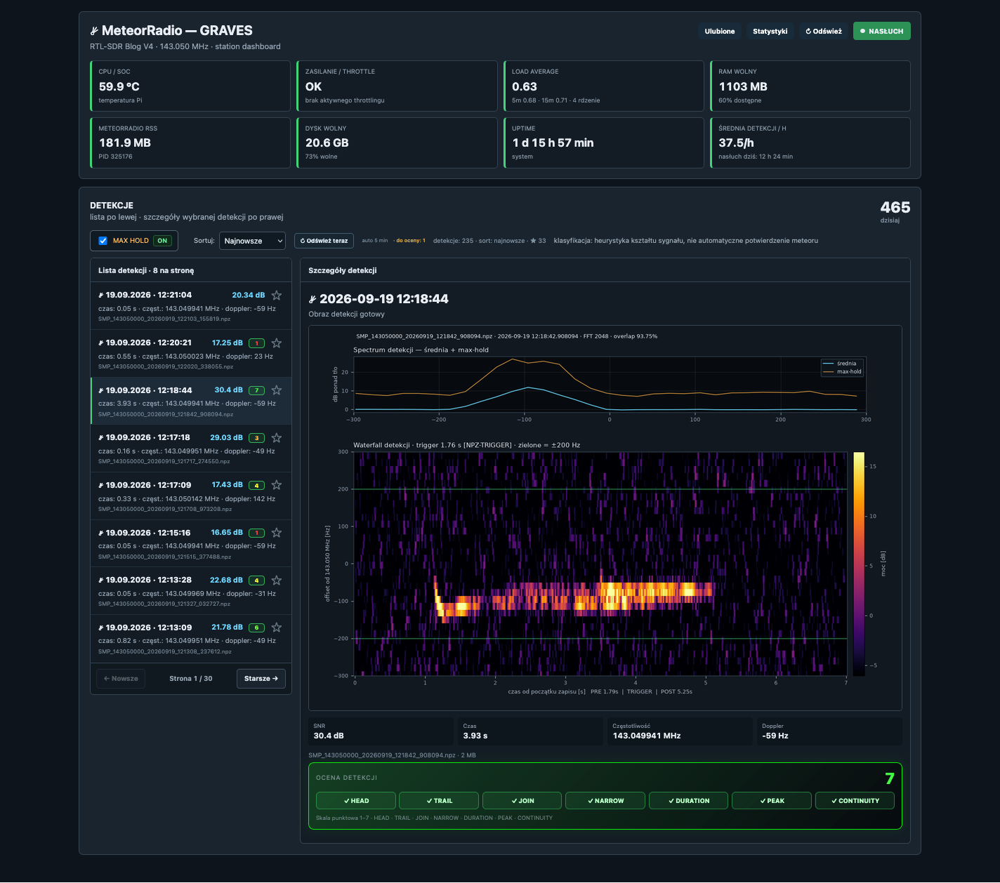

# MeteorRadio V5 — Raspberry Pi + RTL-SDR, detekcja meteorów GRAVES 143.050 MHz

MeteorRadio V5 to stacja do **radiowej detekcji meteorów i meteor scatter** oparta o **Raspberry Pi 4 + RTL-SDR** i sygnał **GRAVES 143.050 MHz**. Projekt bazuje na upstreamowym `rabssm/MeteorRadio`, ale dodaje adaptacyjne nagrywanie detekcji, scoring 1–7, retencję, ulubione, cztery panele WWW, prerender obrazów, healthcheck oraz opcjonalne współdzielenie jednego RTL-SDR z innym odbiornikiem.

<!-- MR_SHOWCASE_V1 -->
## Podgląd projektu



[Więcej zrzutów ekranu](docs/SHOWCASE.md)

## Stan referencyjny

- Golden: `20260919_023454_V5`
- 69 plików w Goldenie
- ok. 1.2 MB bez surowych SMP i cache PNG
- SHA-256 manifestu Goldena: `36dfebd31fec749266fa5f5b902635feef7bd75add4bd57c6205806f22c98b9f`
- odbiór: **GRAVES 143.050 MHz**

## Panele

| Port | Funkcja |
|---:|---|
| 8094 | główny panel detekcji MeteorRadio |
| 8095 | kolejka/status automatycznej oceny |
| 8096 | ulubione, retencja, ręczne usuwanie, duży podgląd obrazu |
| 8097 | statystyki |

## Najważniejsze rozszerzenia V5

`ADAPTIVE_CAPTURE_V2` zapisuje kontekst przed zdarzeniem i dynamicznie kończy zapis po zaniku sygnału. Referencyjne parametry to PRE 1.5 s, minimum POST 0.8 s, hang 1.0 s i maksymalny POST 10 s.

Detekcje dostają ocenę 1–7. Niepolubiona detekcja może być usuwana po liczbie dni odpowiadającej ocenie, a polubione są przechowywane bezterminowo do ręcznego usunięcia.

## Ważne przed publikacją

Nie publikujemy automatycznie zmodyfikowanego upstreamowego `MeteorRadio`, ponieważ upstream nie ma obecnie widocznego pliku licencji. Zmodyfikowany rdzeń może zostać zachowany lokalnie w `private_reference/`, ale ten katalog jest ignorowany przez Git. Szczegóły: `UPSTREAM_LICENSE_NOTICE.md`.

## Jak przygotować repo z finalnej instalki

Jeżeli na Pulpicie Maca znajduje się:

```text
MeteorRadio_V5_ChatGPT_Installer.zip
```

uruchom:

```bash
chmod +x IMPORT_FROM_INSTALLER.command
./IMPORT_FROM_INSTALLER.command
```

Następnie:

```bash
chmod +x VALIDATE_BEFORE_GITHUB.command
./VALIDATE_BEFORE_GITHUB.command
```

Dopiero po przejściu walidacji inicjalizuj Git i publikuj repozytorium.
