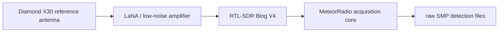
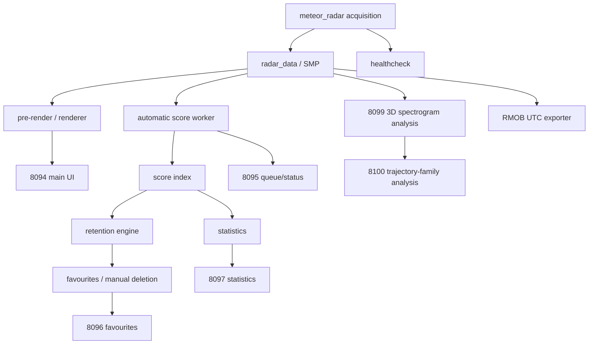
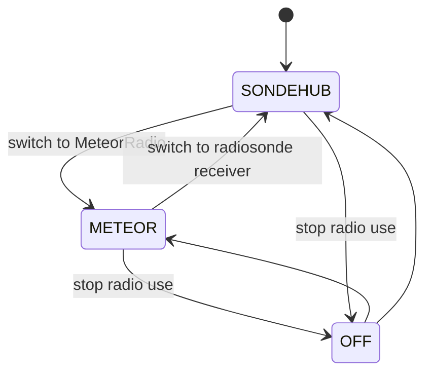

# Architecture

## RF and acquisition path

The exact coax/feedthrough arrangement is installation-specific and should be documented with a hardware photo rather than hard-coded into software.

## Processing path

## Optional shared-radio path

The reference station can share a single RTL-SDR with another receiver. `radio-owner-control` serializes ownership and `radio-owner-restore.service` restores the previously persisted owner after boot.

On a dedicated MeteorRadio-only station this arbitration layer may be unnecessary.
