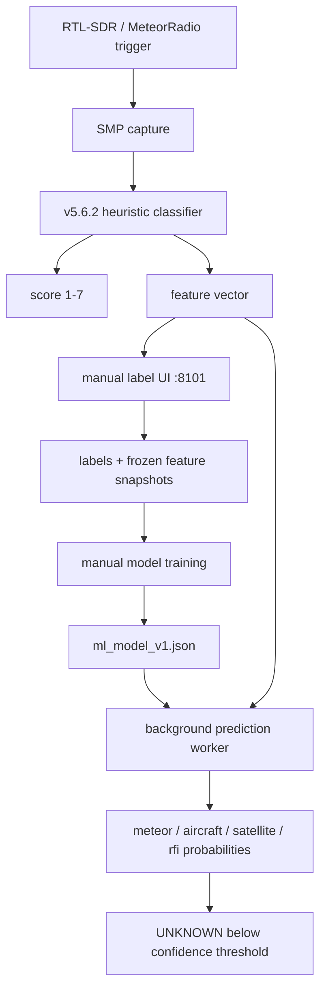

# ML false-positive classifier

## Purpose

MeteorRadio ML v1 adds a supervised post-capture classifier without changing the
acquisition trigger. This preserves weak or unusual events first and classifies
them later.

## Safety boundary

ML v1 is **advisory only**:

- no RTL-SDR ownership,
- no changes to trigger thresholds,
- no automatic deletion,
- no replacement of the 1–7 score,
- no retention decision based on ML.

The model can therefore be evaluated against manual review without risking data
loss.

## Data flow

## Why UNKNOWN is a threshold

`unknown` is a human review state, not a coherent physical signal class. The
model is trained on concrete classes (`meteor`, `aircraft`, `satellite`, `rfi`).
If the highest probability is below the configured confidence threshold, the
runtime result is `unknown`.

## Model v1

The first model is a feature-based logistic classifier. Training uses median
imputation, standardisation and class-balanced logistic regression. The fitted
preprocessing values and coefficients are exported to JSON; inference is pure
Python and does not require scikit-learn on the Raspberry Pi.

This baseline is deliberately explainable and lightweight. A later image/CNN
model can be compared against it using the same manual labels, without removing
the feature model.

## Validation before any automatic filtering

Before ML can influence retention, measure at least:

- per-class precision/recall,
- confusion matrix,
- false-negative rate for manually confirmed meteors,
- performance by heuristic score 1–7,
- stability on different days and meteor showers,
- a hold-out period not used for training.

Automatic deletion should remain disabled until the local dataset demonstrates a
safe false-negative rate for the station's scientific goal.
