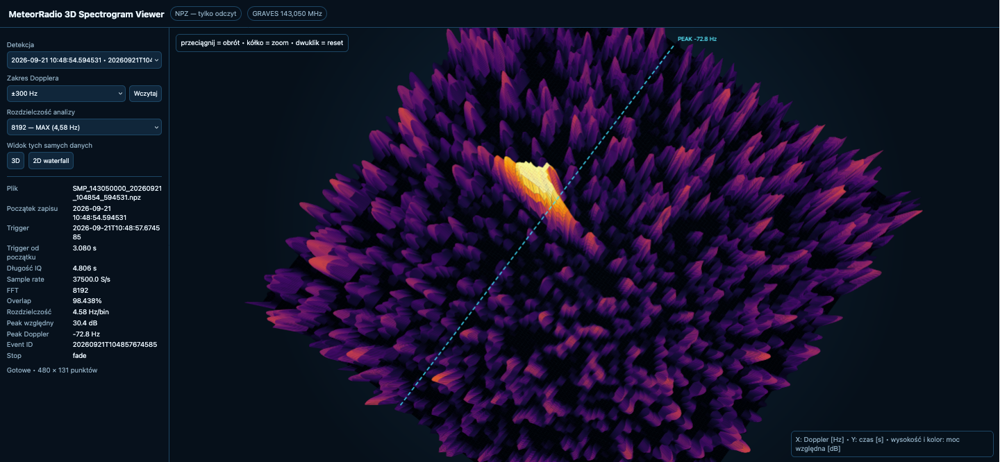
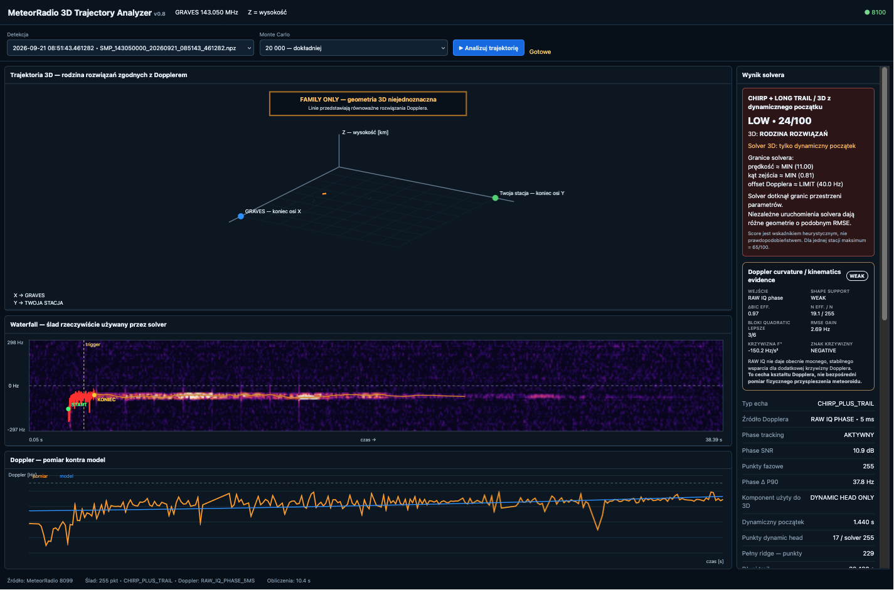

# MeteorRadio V5 — screenshots and interface showcase

These screenshots document the V5 reference station UI for GRAVES 143.050 MHz radio-meteor / meteor-scatter reception. The PNG files were exported without embedded image metadata and do not contain the station hostname, private IP address, exact coordinates, or street address.

## Main dashboard

The main panel presents Raspberry Pi health, detection navigation, signal spectrum, waterfall analysis, duration/frequency/Doppler information and the local 1–7 scoring result.

## Statistics dashboard

The statistics view summarizes detections, scoring distribution, retention, favourites, score-index state and recent station activity.

## Detection gallery

[Open the complete tall gallery screenshot](../assets/screenshots/detections-gallery-full.png).

## Search terms

MeteorRadio V5, radio meteor detection, meteor scatter, GRAVES radar, GRAVES 143.050 MHz, RTL-SDR, RTL-SDR Blog V4, Raspberry Pi, citizen science, radio observation, SDR waterfall.

---

## 3D Spectrogram Viewer

Read-only analysis of saved observation data with selectable Doppler span and FFT resolution.

## 3D Trajectory Analyzer

Single-station bistatic geometry exploration based on measured Doppler evolution. Displayed solutions are hypotheses/families of compatible geometries rather than a unique trajectory.
